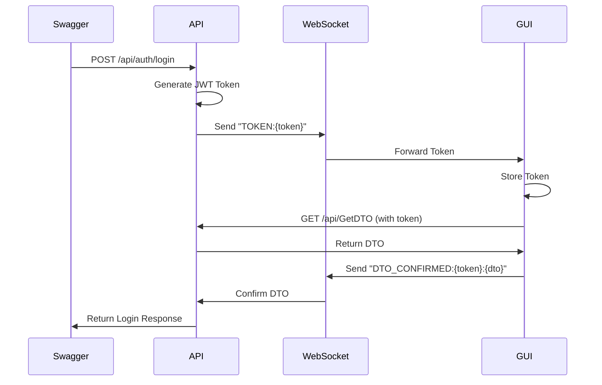

# Technical Documentation: Authentication System Workflow
**Version:** 1.0  
**Date:** [Current Date]

## Table of Contents
- System Overview
- Login Flow via Swagger
- Token Transmission Approaches  
  3.1 Manual URL Redirection  
  3.2 HTTP Client Approach  
  3.3 WebSocket Approach  
- Current Implementation: WebSocket Workflow
- Cross-Domain Considerations
- Pros and Cons Analysis
- Future Recommendations for Production

## 1. System Overview
The system comprises three components:
- **API:** .NET Core 6 backend handling authentication and data.
- **GUI:** ASP.NET 4.7 frontend for user interaction.
- **TPA:** Third-Party Application (optional, for future integrations).

The authentication flow uses JWT tokens for security and WebSocket for real-time token transmission between the API and GUI.

## 2. Login Flow via Swagger
### User Login:
- Submit credentials via Swagger UI (`POST /api/auth/login`).
- API validates credentials and generates a JWT token.

### Token Transmission:
- API sends the token to the GUI via WebSocket.

### GUI Operations:
- Stores the token in cookies/sessionStorage.
- Fetches user-specific data (DTO) using the token.

### Login Flow Diagram

## 3. Token Transmission Approaches

### 3.1 Manual URL Redirection
**Approach:**  
- API returns a redirection URL with the token as a query parameter (e.g., `https://gui.com?token=xyz`).  
- User manually copies the URL and opens it in a browser.

**Pros:**  
- Simple to implement.  
- No dependency on real-time protocols.  

**Cons:**  
- **Security Risk:** Tokens exposed in URLs (browser history/logs).  
- **User Experience:** Manual steps disrupt workflow.  
- **Scalability:** Unsuitable for automated systems.  

**Why Not Used:**  
- Requires manual intervention, which is error-prone and insecure.

### 3.2 HTTP Client Approach
**Approach:**  
Use `HttpClient` to auto-follow redirection links from the API.

```csharp
var response = await httpClient.GetAsync(redirectUrl);
```

**Pros:**  
- Automated token handling.  
- No user intervention required.  

**Cons:**  
- **Cookie Storage:** Cookies are stored in the server context, not the user’s browser.  
- **Response Handling:** Always returns `200 OK`, making error handling difficult.  
- **Cross-Domain Issues:** Requires complex CORS configuration.  

**Why Not Used:**  
- Fails to persist tokens in the user’s browser context.  
- Unsuitable for real-time GUI updates.

### 3.3 WebSocket Approach (Current Implementation)
**Approach:**  
- **WebSocket Connection:** GUI establishes a persistent connection to `ws://localhost:8181`.  
- **Token Transmission:** API sends the token via WebSocket after successful login.  
- **GUI Processing:** Stores token → Fetches DTO → Confirms via WebSocket (`DTO_CONFIRMED:token:json`).  

**Pros:**  
- Real-Time token delivery without polling.  
- Tokens never exposed in URLs.  
- Cross-Domain support with proper CORS.  
- Scales efficiently for multiple clients.  

**Cons:**  
- Requires WebSocket server management.  
- Firewall issues with WebSocket ports (e.g., 8181).  
- Persistent connections consume resources.  

**Why Chosen:**  
- Best balance of security, automation, and cross-domain support.

## 4. Current Implementation: WebSocket Workflow
**API Sequence:**  
1. User logs in → API generates JWT token → Sends token via WebSocket.  

**GUI Sequence:**  
1. Receives token → Stores it → Fetches DTO → Confirms via WebSocket.  

**Timeout Handling:**  
- API waits 30 seconds for GUI confirmation.



## 5. Cross-Domain Considerations
**CORS Configuration:**  
```csharp
builder.Services.AddCors(options => 
    options.AddPolicy("AllowAll", policy => 
        policy.AllowAnyOrigin()
              .AllowAnyMethod()
              .AllowAnyHeader()));
```

**WebSocket Security:**  
- Use `wss://` in production.  
- Validate origins on the WebSocket server.

## 6. Pros and Cons Analysis
| Criteria          | Manual URL Redirection | HTTP Client | WebSocket |
|-------------------|------------------------|-------------|-----------|
| Security          | ❌ (Token in URL)      | ✅           | ✅ (Encrypted) |
| Automation        | ❌ (Manual steps)      | ✅           | ✅         |
| Cross-Domain      | ✅                      | ❌ (CORS)    | ✅         |
| Scalability       | ❌                      | ⚠️ (Limited) | ✅ (High)  |
| User Experience   | ❌                      | ⚠️ (Cookie issues) | ✅   |

## 7. Future Recommendations for Production
**WebSocket Enhancements:**  
- Use Azure SignalR or Redis for scaling WebSocket connections.  
- Implement heartbeats for disconnected clients.  

**Security:**  
- Encrypt tokens (e.g., AES).  
- Use HTTPS/WSS exclusively.  

**Load Balancing:**  
- Use sticky sessions for WebSocket connections.  

**Monitoring:**  
- Track message rates and connection lifetimes.  

**Fallback Mechanism:**  
- Use long-polling for clients blocking WebSocket.  

**Token Expiry:**  
- Implement refresh tokens for long-lived sessions.

## Conclusion
The WebSocket-based approach provides a secure, real-time, and cross-domain solution for token transmission. While complex, it overcomes the limitations of manual and HTTP client approaches.

### Next Steps:
- Conduct load testing on WebSocket connections.  
- Implement token refresh logic.  
- Set up monitoring for WebSocket performance metrics.  

**Prepared By:** [Your Name]  
**Reviewed By:** [Team Member Name]  
**Approved By:** [Stakeholder Name]  
